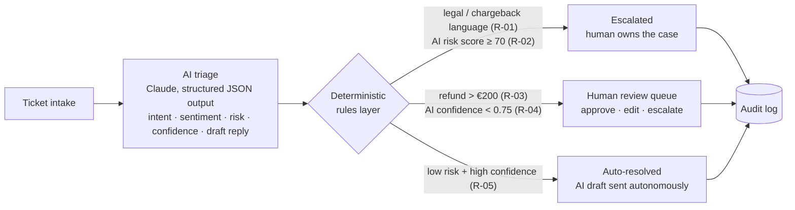

# OpsPilot — AI Triage & Human-in-the-Loop Operations Console

A working demo of an **AI-led, human-orchestrated** customer support operation: AI performs first-pass triage, a transparent rules layer intercepts by risk, and humans review only what actually needs them.

**▶ Live demo:** https://claude.ai/public/artifacts/938348de-f8ad-47a2-8a3c-e7a1c55cec54

> The hard part of AI in operations isn't the model — it's deciding where the human belongs.

## The problem this demonstrates

Most "AI for support" demos do one of two things: automate everything (unsafe) or draft replies for humans to approve one by one (no leverage). Real operations need a third model: **route work between AI, deterministic rules, and people based on complexity and risk** — with an audit trail for every decision.

OpsPilot shows that operating model end to end on synthetic travel-booking support tickets.

## How it works

1. **AI triage.** Each ticket goes to Claude with a strict JSON schema: intent, sentiment, a 0–100 risk score (financial / legal / fraud / reputational exposure), a confidence score, and a customer-ready draft reply.
2. **Rules intercept — after the AI, not instead of it.** A small, fully transparent, deterministic rule set decides routing. The AI informs the decision; it never makes the final call on high-stakes work.
3. **Humans where it matters.** The review queue supports approve / edit / escalate. Approving or editing closes the ticket with a `human-approved` trail.
4. **Everything is logged.** Every routing decision, rule fired, and human action lands in a timestamped audit log. Each ticket card shows its full **decision trace**: `AI verdict → rule fired → lane`.

## Routing rules

| Rule | Condition | Route |
|------|-----------|-------|
| R-01 | Legal / chargeback / fraud language detected | Escalate |
| R-02 | AI risk score ≥ 70 | Escalate |
| R-03 | Refund exposure > €200 | Human review |
| R-04 | AI confidence < 0.75 | Human review |
| R-05 | Default (low risk, high confidence) | Auto-resolve |

The thresholds are the point: they encode an organization's *risk appetite* as configuration. Changing where the human sits in the loop is a one-line change, not a re-architecture.

## Metrics tracked

- **Deflection rate** — share of triaged tickets resolved autonomously
- **Rule intercepts** — high-risk work caught and routed to people
- **Estimated minutes saved** — 8 min per auto-resolved ticket, 4 min per AI-drafted + human-approved ticket (illustrative assumptions)

## Tech

Single-file React app (`OpsPilot.jsx`) built as a [Claude artifact](https://claude.ai): React state, Tailwind, lucide-react icons, Anthropic Messages API with structured JSON output and fence-stripping/error handling. No backend, no database — by design (see scope below).

## Honest scoping: demo vs. production

This is a **demonstration of an operating model**, not a production system. Tickets are synthetic. A production version would need, at minimum:

- A real intake integration (email/chat/ticketing webhook) and queue
- Server-side API calls with proper key management (never client-side)
- Persistent storage and a real immutable audit store
- Authentication, roles, and per-team routing policies
- Evaluation: golden sets for triage accuracy, drift monitoring on risk/confidence calibration, and feedback loops from human overrides back into prompts and thresholds
- Privacy and data-governance controls appropriate to real customer data

The patterns here (structured output, rules-after-AI, confidence-based routing, decision traces) are extracted from a larger production-grade prototype I built for clinical operations: [clinical-copilot](https://github.com/gitsukrit/clinical-copilot).

## Author

**Sukrit Chakravarty** — 14+ years in regulated healthcare operations, building AI-enabled workflows with compliance and human oversight designed in from the start.
[LinkedIn](https://www.linkedin.com/in/sukrit-chakravarty-549016156) · [GitHub](https://github.com/gitsukrit)
